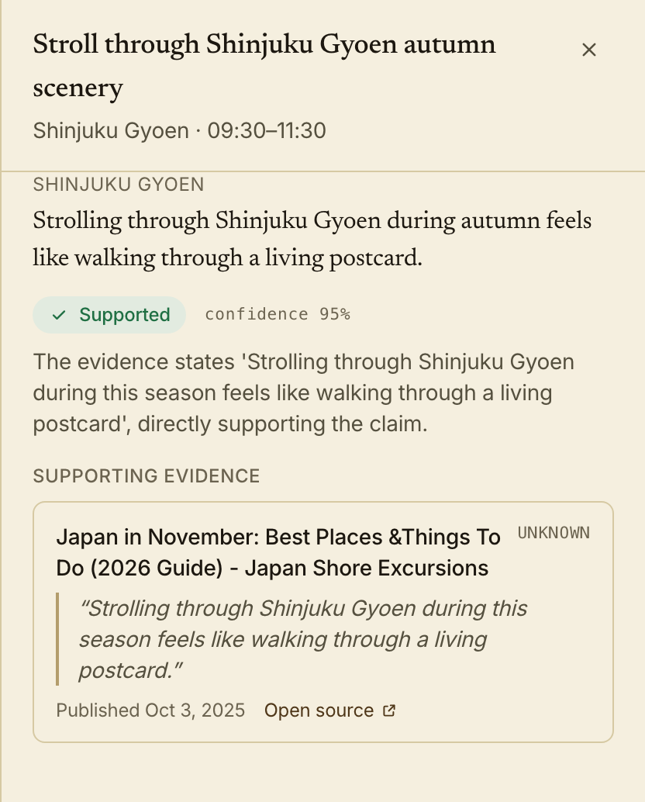

<div align="center">

# Periplus

**An evidence-grounded multi-agent system for travel research and publishing.**

Periplus turns a trip brief into a verified itinerary and publishable content.
Every factual claim remains traceable to source evidence, an independent verdict,
and the stage artifact that produced it.

[](https://github.com/parthenon-labs/periplus/actions/workflows/ci.yml)

[Live demo](https://parthenon-labs.github.io/periplus/) · [Architecture](docs/architecture.md) · [Web design](DESIGN.md) · [Product](PRODUCT.md)

<sub>The demo is a static build of one captured run — a four-night Tokyo trip — with the brief
pinned and no backend behind it. Everything below runs for real from a clone.</sub>


<sub>The last artifact of a run: an illustrated piece written from the itinerary, stating as fact
only the claims the Auditor let through.</sub>

</div>

---

## System

```text
TripBrief
    │
    ▼
Explorer ─────────▶ ResearchBundle
 research         claims + exact-quote evidence
    │
    ▼
Auditor ──────────▶ VerifiedBundle
 verification     supported · partial · stale · unsupported · contradicted · no_evidence
    │
    ▼
Navigator ────────▶ Itinerary
 planning         feasible, day-by-day schedule
    │
    ▼
Chronicler ───────▶ ContentSet
 writing          itinerary · article · social copy
    │
    ▼
Editor ───────────▶ ContentSet
 revision         scannable, grounded to the same claims, nothing added
    │
    ▼
Illustrator ──────▶ Illustration[]
 imagery          visuals grounded in verified subjects
```

**Hermes** runs the graph. It owns stage order, gates, retries, run-wide budgets,
artifact retention, replay, and recovery after process failure. Agents own domain
work; the orchestrator knows only typed stage contracts.

## Two boundaries define the project

### Facts cross the evidence boundary

Explorer cannot approve its own findings. It emits claims bound to exact source
quotes; Auditor receives only those claims and their cited evidence, then performs
a separate verification pass. Application code—not the model—enforces citation
membership, freshness windows, input ceilings, and the rule that evidence-free
claims cannot be promoted.

```text
Claim ──cites──▶ Evidence ──checked by──▶ Auditor ──emits──▶ Verdict
```

Unsupported and contradictory claims remain visible outputs. The system does not
turn uncertainty into confident prose merely to complete a plan.

<div align="center">
  
  <br>
  <sub>The first fact in the article above, opened: the claim it rests on, the verdict and its
  confidence, the verifier's reasoning, and the exact quote it was checked against.</sub>
</div>

### Work crosses the artifact boundary

Every stage emits a typed, serialisable artifact. Hermes applies a deterministic
gate before the next stage may run and retains every attempt, including failed
ones. A run can therefore be inspected, replayed from a passed boundary, or
resumed after a restart without repeating the entire pipeline.

```text
artifact N ──gate──▶ artifact N+1
     │
     └── retained for audit, replay, and crash recovery
```

Replay continues against the same run-wide budget; it is not a way to reset token,
query, fetch, or wall-clock ceilings one stage at a time.

## Engineering decisions

| Concern | Approach |
| --- | --- |
| Provenance | Evidence stores the source URL, exact quote, observed date, and retrieval metadata |
| Verification | Separate agent, narrow input, strict cited-ID validation, deterministic freshness |
| Structured output | Pydantic artifacts with validation and bounded repair for malformed model responses |
| Orchestration | Explicit stage order, deterministic gates, bounded retries, cumulative run budgets |
| Durability | PostgreSQL run and artifact stores support restart-time recovery from the last passed boundary |
| Retrieval | Search/fetch seam, polite concurrent fetching, content cleaning, and persistent page cache |
| Evidence reuse | Optional local embeddings and pgvector lookup before a repeated network fetch |
| Provider isolation | Models, search, maps, and image generation each sit behind independent seams |
| Testability | Scripted model/search providers, in-process HTTP fixtures, fake clocks, and no-network tests |
| Evaluation | Golden-set cases over fixed corpora, threshold assertions on grounding and cost metrics, committed before/after reports |

## Failure is represented, not hidden

Periplus distinguishes failures that ordinary agent demos often collapse together:

- a claim with no evidence receives `no_evidence` without spending a model call;
- stale evidence is determined by code from claim-specific freshness windows;
- malformed structured output enters a bounded repair path;
- transient provider failures may retry, while logical stage failures do not;
- a stage with no usable artifact fails its gate instead of silently advancing;
- retrieval and verification gaps survive into the final result as inspectable data.

This makes a partially verified itinerary more useful than an apparently complete,
untraceable one.

## Run locally

```sh
cp .env.example .env

cd server
python3.11 -m venv .venv
.venv/bin/pip install -r requirements.txt
.venv/bin/uvicorn periplus.api.app:app --reload
```

The `.env` is resolved from the repository root regardless of where the process is
started; a `server/.env` overrides it if you keep one there.

In another shell:

```sh
cd web
npm install
npm run dev
```

Model access uses an OpenAI-compatible endpoint. Search, maps, illustration, the
semantic evidence cache, and persistence are configured independently; see
[`.env.example`](.env.example) for the complete surface.

## Verify offline

```sh
cd server
python3.11 -m venv .venv
.venv/bin/pip install -r requirements-dev.txt
.venv/bin/python -m pytest
```

The test suite does not require API keys or network access. `ScriptedClient` and
`ScriptedSearch` replace external providers, page fetches use an in-process HTTP
transport, and orchestration tests use a fake clock rather than real sleeps.

```sh
cd web
npm install
npm run typecheck
npm test
```

## Evaluate offline

Tests establish that the pipeline does what it was told. They cannot establish whether
what it was told is any good. That question needs the same fixed inputs measured before
and after a change:

```sh
cd server
.venv/bin/python -m periplus.evals                      # run the suite, print the report
.venv/bin/python -m periplus.evals --out evals/reports   # write report.json and report.md
.venv/bin/python -m periplus.evals --diff evals/reports/baseline.json
```

Each case in [`server/evals/cases/`](server/evals/cases) pins a trip brief, the exact
corpus retrieval will serve, ground-truth verdict labels, a frozen `as_of` date, and
threshold assertions on [`RunMetrics`](server/periplus/evals/metrics.py) — gap rate,
verdict distribution, citation integrity, tokens, spend, retries. Assertions are ranges,
never literal model output: a suite that fails every day for cosmetic reasons is switched
off within a week.

Only the two seams that leave the process are replaced, so a case exercises the real
orchestrator, agents, gates and budget accounting. Exit status is non-zero on any unmet
threshold, and the run needs no API key, no network and no database.

What this measures and what it does not, stated plainly: with the offline oracle answering
verification, model judgement is held constant, so the suite measures the *pipeline* —
exact-quote grounding, freshness downgrades, no-evidence handling, batch and budget
ceilings, gate rejection, end-to-end citation integrity. Judging whether a prompt edit made
the model a better auditor requires the live provider answering the same corpora; the
metrics and report layers are provider-agnostic so that mode slots in without rewriting the
golden set.

## Repository map

```text
server/periplus/
├── agents/          Explorer, Auditor, Navigator, Chronicler, Editor, Illustrator
├── orchestrator/    Hermes, stage adapters, gates, budgets, artifact retention
├── retrieval/       search, fetch, cleaning, caching, provenance
├── storage/         runs, stage artifacts, pgvector evidence cache
├── llm/             provider seam, structured output, repair, usage accounting
├── embeddings/      local sentence-transformers seam behind the evidence cache
├── geo/             travel time and distance providers behind one interface
├── media/           image generation providers behind one interface
├── evals/           golden-set harness, metrics, thresholds, before/after reports
├── api/             run submission, progress, recovery, result contracts
├── models.py        every typed artifact and stage contract in one file
└── config.py        the whole configurable surface, mirrored by .env.example

server/evals/
├── cases/           committed golden set, one JSON case per file
└── reports/         committed baseline report, and the target for --out

server/tests/        the offline suite: scripted providers, HTTP fixtures, fake clocks

docs/
├── architecture.md  stage contracts, gates, budgets, and the reasoning behind them
└── screenshots/     captured from the run the demo ships

web/src/
├── routes/          trip brief, live run, and generated results
├── components/      stage progress and evidence-oriented result UI
├── api/             generated OpenAPI contracts and the typed queries over them
└── lib/             verdict, stage and formatting helpers shared by both
```

The deeper rationale lives in [the architecture document](docs/architecture.md);
interaction and visual rules live in [the web design notes](DESIGN.md).

---

<div align="center">
  <sub>Python · FastAPI · Pydantic · PostgreSQL · pgvector · React · TypeScript</sub>
  <br><br>
  <sub>A periplus was an ancient sailing log: observations recorded leg by leg, in the order encountered.</sub>
  <br>
  <sub>The system follows the same rule—record the evidence before writing the journey.</sub>
  <br><br>
  <sub>MIT</sub>
</div>
